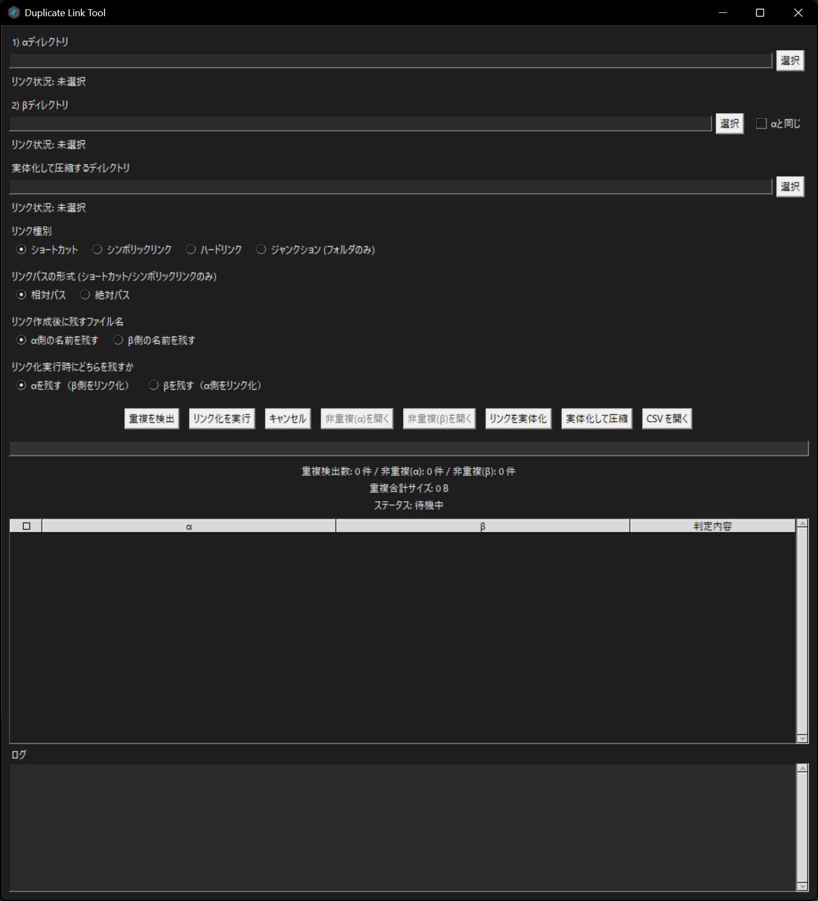

# Duplicate Link Tool



Duplicate Link Tool は、2 つのフォルダを比較して重複ファイルを見つけ、重複側をショートカットやリンクに置き換えることでディスク容量を節約できる Windows 向けツールです。GUI での操作に対応し、高速かつ正確な重複ファイル検出が特徴で、以下のステップで判定を行います。

1. **ファイル名とサイズが同一** … その時点で同一ファイルとみなします。
2. **それ以外でサイズが一致した組み合わせ** … サイズが同一のファイル同士のSHA-256によるハッシュ比較を実施し、完全一致した場合に重複と判定します。

このハイブリッド方式により、不要なハッシュ計算を避けつつ精度を保てるため、大量のファイルでも軽快に処理できます。

## 主な機能

### 重複検出と処理
- **高速な重複検出**: ファイル名・サイズによる一次判定と、必要時のみSHA-256ハッシュを計算する効率的なアルゴリズム
- **同一フォルダ比較の最適化**: 「αと同じ」チェックボックスで同じフォルダ内の重複を高速検出
- **検出結果の選択機能**: チェックボックスで処理したいファイルを個別選択（Shift+クリックで範囲選択も可能）
- **重複検出結果を一覧表示**: 確認しながら処理を進められます

### リンク作成機能
- **4種類のリンク形式に対応**: ショートカット／シンボリックリンク／ハードリンク／ジャンクション
- **相対パス・絶対パスの選択**: ポータブル性を重視する場合は相対パス、安定性を重視する場合は絶対パスを選択可能（デフォルト：相対パス）
- **どちらを残すか選択可能**: α側・β側のどちらを実体として残すかを柔軟に選択
- **リンク状況の詳細表示**: ショートカット、シンボリックリンク、ハードリンク、ジャンクションを個別にカウント・表示

### 便利な機能
- **パス入力履歴**: 上下矢印キーで過去に入力したパスを再利用（最大50件、セッション中保持）
- **Undo/Redo機能**: パス入力欄でCtrl+Z（元に戻す）とCtrl+Y（やり直し）が使用可能
- **非重複ファイルの確認**: 重複側のフォルダから、非重複ファイルをエクスプローラーで一覧表示可能
- **リンクの実体化とZIP化**: リンクを実体化して ZIP にまとめる補助機能を搭載
- **CSV出力とログ記録**: 比較結果を `duplicate_report.csv` に出力し、操作ログを記録

## 使い方

1. **フォルダの指定**
   - αディレクトリ（比較対象の任意フォルダ）とβディレクトリ（比較対象の任意フォルダ）を選択します
   - 同じフォルダ内で重複検出したい場合は「αと同じ」チェックボックスをオンにします
   - パス入力欄では履歴機能（↑↓キー）とUndo/Redo（Ctrl+Z/Y）が使用できます

2. **重複の検出**
   - 「重複を検出」ボタンでスキャンを実行すると、重複一覧が表示されます
   - 検出結果リストの左側にあるチェックボックスで、処理したいファイルを選択できます
   - ヘッダーのチェックボックスで全選択/全解除、Shift+クリックで範囲選択が可能です

3. **リンク化の実行**
   - リンク種別（ショートカット／シンボリックリンク／ハードリンク／ジャンクション）を選択
   - パス形式（相対パス／絶対パス）を選択（デフォルト：相対パス）
   - どちらを残すか（αを残す／βを残す）を選択（デフォルト：αを残す）
   - 「リンク化を実行」で選択したファイルをリンクに置き換え（元ファイルは削除されます）

4. **その他機能**
   - 非重複ファイルの確認：重複していないファイルをエクスプローラーで開きます
   - リンクの実体化：リンクを実体ファイルに戻します
   - ZIP化：実体化したファイルをZIPにまとめます

> **注意:** ショートカットやリンク作成には管理者権限が必要です。起動時に昇格ダイアログが表示されます。

## 動作環境

- Windows 10 以降（管理者権限が必要）
- Python 3.9 以上（ソースから実行する場合）
- PowerShell（ショートカット操作やリンク実体化に使用）

## 重複判定のアルゴリズム

前述の 2 段階判定を迅速に行うため、メイン側フォルダのメタデータを事前にインデックス化し、比較側はスレッドプールで並列処理します。サイズが一致した候補については、必要になった場合にのみ SHA-256 を計算することで無駄なハッシュ処理を最小限に抑えています。

## インストールと実行

### 1. リリース版

1. GitHub リリースページから最新の `DuplicateLinkTool.exe` をダウンロードします。
2. ファイルを右クリックし、「管理者として実行」を選択します。
3. 起動後は GUI の指示に従い、メインフォルダ（残す側）と比較フォルダ（リンク化する側）を選択してください。

> **注意:** リポジトリにはビルド済みの EXE は含まれていません。最新リリースをご利用ください。

### 2. ソースコードから実行

1. 任意のディレクトリでリポジトリをクローンします。
2. （任意）仮想環境を作成してアクティベートします。
3. 追加の外部パッケージは不要です。以下のコマンドで起動できます。

```powershell
python duplicate_link_tool_windows.py
```

管理者権限での再起動を避けたい場合は、実行前に環境変数 `DLTOOL_SKIP_ELEVATION=1` を設定してください。

```powershell
set DLTOOL_SKIP_ELEVATION=1
python duplicate_link_tool_windows.py
```

## バージョン情報

現在のバージョン: **v1.1.0 (2025-11-20)**

詳細な変更点については [PATCH_NOTES.md](PATCH_NOTES.md) をご覧ください。

### v1.1.0の新機能
- パス入力欄の履歴機能（↑↓キーで再利用、最大50件）
- Undo/Redo機能（Ctrl+Z/Y）
- 同一フォルダ比較のための「αと同じ」チェックボックス
- 検出結果の個別選択機能（チェックボックス、範囲選択対応）
- 相対パス/絶対パスの選択機能
- どちらを残すかの選択機能（α側/β側）
- リンク情報の詳細表示（シンボリックリンク、ジャンクション、ハードリンクを個別表示）
- UI表記の改善（α/β表記に統一、フォルダ名をヘッダーに表示）
- デフォルト設定の最適化（ショートカット、相対パス、α側を残す）

## 使い方の流れ

1. αディレクトリとβディレクトリを指定します（同一フォルダ比較の場合は「αと同じ」をチェック）。
2. 「重複を検出」を実行すると、重複ファイルが一覧に表示されます。
3. 検出結果リストでチェックボックスを使い、処理したいファイルを選択します。
4. リンク種別（ショートカット／シンボリックリンク／ハードリンク／ジャンクション）、パス形式（相対／絶対）、残す側（α／β）を選択します。
5. 「リンク化を実行」で選択したファイルをリンクに置き換えます（元ファイルは削除されます）。
6. 必要に応じて、非重複ファイルの確認やリンクの実体化・ZIP化を行ってください。

## 出力とログ

- `duplicate_report.csv`: 検出した重複の一覧（メイン側、比較側、判定理由）
- `link_tool_log_*.txt`: 主要な操作ログ
- `startup_debug.log`: 権限昇格や EXE 起動に関するデバッグログ

## EXE のビルド方法

プロジェクトに同梱されている PyInstaller 設定ファイル `DuplicateLinkTool.spec` を使用します。

1. PyInstaller をインストールします。

```powershell
pip install pyinstaller
```

2. プロジェクトのルートで以下を実行します。

```powershell
pyinstaller DuplicateLinkTool.spec
```

3. `dist/DuplicateLinkTool.exe` が生成されます。必要に応じて `version_info.txt` や `assets/duplicate_link_tool.ico` を調整してください。

## その他

- `zip_util.py`: リンクの実体化および ZIP 化に関連するユーティリティ群をまとめています。

## トラブルシューティング

- **管理者ダイアログが表示され続ける**: PowerShell の実行ポリシーや UAC 設定を確認してください。開発用途で権限昇格を無効にする場合は `DLTOOL_SKIP_ELEVATION=1` を設定します。
- **ショートカットの作成に失敗する**: PowerShell または Windows Script Host が無効化されていないか確認してください。
- **リンク先の実体化でエラーが出る**: リンク先が既に削除されている場合があります。ログに詳細が出力されます。

## 免責事項

本ツールは重複ファイルの削除やリンク化を自動で行います。重要データでの使用に先立ち、十分なバックアップを取得してください。利用に伴う損害について開発者は責任を負いません。
